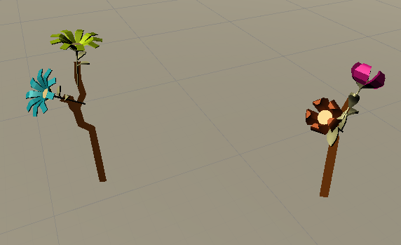
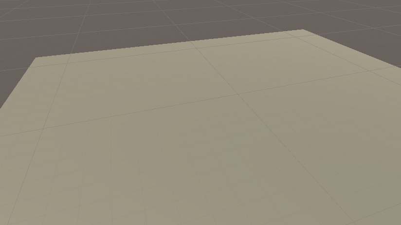
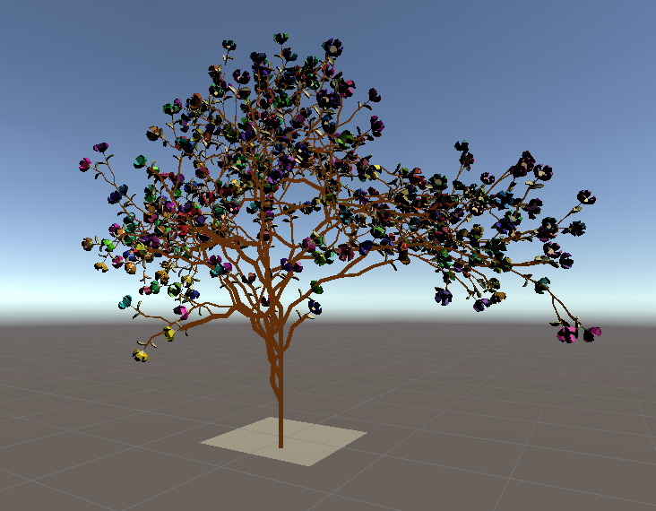
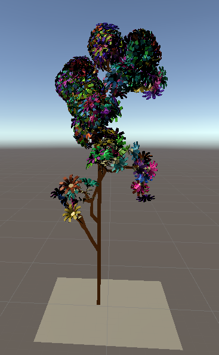

# Generation procédurale d'arbre (L-System)
Apllication Unity3D 2020.1.4f1


# Contexte

Travail réalisé lors du cours de Mondes virtuels en Master 2 Informatique GAMAGORA.

# Sources
## Tutos Youtube :
* The Coding Train :
  - 8.5: L-Systems - The Nature of Code : https://www.youtube.com/watch?v=f6ra024-ASY
  - Coding Challenge #16: L-System Fractal Trees : https://www.youtube.com/watch?v=E1B4UoSQMFw
* Peter Phillips :
  - L-Systems Unity Tutorial [2018.1] : https://www.youtube.com/watch?v=tUbTGWl-qus1

## Liens :
- https://mizzlrblog.wordpress.com/2016/06/17/l-system-compiler-and-renderer-in-python/
- https://en.wikipedia.org/wiki/L-system

# L-System
***LSystem.cs***

Le L-System est le corps de la création de la génération procédurale. C'est un ensemble de règle de réécriture de caractère.
```cs
lst_Rules = new List<Rule>();

        lst_Rules.Add(new Rule("T", "FX"));
        lst_Rules.Add(new Rule("F", "F"));
        lst_Rules.Add(new Rule("X", "[+F-F[+XF-F+FX]--F+F-FX]"));
```
Chaque règle prend un caractère en entré et ressort une chaine de caractère en sortie (*ici **"X"** devient **"[+F-F[+XF-F+FX]--F+F-FX]"***).

Pour lancer le L-System il faut choisir un départ : **axiom**.
```cs
[SerializeField] public string axiom = "T";
```
Itérations :
1. T
2. FX
3. F[+F-F[+XF-F+FX]--F+F-FX]
4. F[+F-F[+[+F-F[+XF-F+FX]--F+F-FX]F-F+F[+F-F[+XF-F+FX]--F+F-FX]]--F+F-F[+F-F[+XF-F+FX]--F+F-FX]]
5. ...

Chaque caractère est lié à une règle necessaire à la création de l'arbre.
* F : Dessine une ligne
* [ : Sauvegarde la position courante
* ] : Charge la derniere position sauvegardée
* \+ : Applique une rotation sur le vecteur **forward** (0,0,1) et **right** (1,0,0)  
* \- : Applique une rotation sur le vecteur **back** (0,0,-1) et **left**  (-1,0,0)

```cs
private IEnumerator turtle()
{
    float length = initialLength;
    float width = initialWidth;
    foreach (char current in sentence)
    {
        switch (current)
        {
            case 'F':
                Vector3 initialPosition = transform.localPosition;
                transform.Translate(Vector3.up * length);
                if (currentLine == null)
                {
                   GameObject treeSegment = Instantiate(branch, transform.parent);
                   treeSegment.GetComponent<LineRenderer>().SetPosition(0, initialPosition);
                   treeSegment.GetComponent<LineRenderer>().SetPosition(1, transform.localPosition);
                   currentLine = treeSegment.GetComponent<LineRenderer>();
                }
                else
                {
                   currentLine.positionCount++;
                   currentLine.SetPosition(currentLine.positionCount - 1, transform.localPosition);
                }
                yield return new WaitForSeconds(wait);
                break;

            case '+':
                transform.Rotate(Vector3.forward * GetRandomAngle());
                transform.Rotate(Vector3.right * GetRandomAngle());
                break;

            case '[':
                transformStack.Add(new TransformInfo(transform.position, transform.rotation));

                break;

            case ']':
                TransformInfo ti = transformStack[transformStack.Count - 1];
                transform.position = ti.pos;
                transform.rotation = ti.rot;
                transformStack.Remove(transformStack[transformStack.Count - 1]);
                currentLine = null;
                break;

            case '-':
                transform.Rotate(Vector3.back * GetRandomAngle());
                transform.Rotate(Vector3.left * GetRandomAngle());
                break;

            default:
                throw new InvalidOperationException("Invalid l-tree operation");
        }
    }
    yield return null;
}
```


## Variables

Pour rendre l'arbre réaliste, nous appliquons on coefficient de longueur et d'épaisseur à chaque fois que nous créons un embranchement **lcoef** et **wcoef**.

```cs
[SerializeField] public float initialLength = 30.0f;
[SerializeField] public float initialWidth = 5.0f;
[SerializeField] public float lCoef = 0.9f;
[SerializeField] public float wCoef = 0.8f;

/***************************/
    float length = initialLength;
    float width = initialWidth;
    foreach (char current in sentence)
    {
        switch (current)
        {
          /***************************/
            case '[':
                /***************************/
                length *= lCoef;
                width *= wCoef;
                break;

            case ']':
                /***************************/
                length *= 1 / lCoef;
                width *= 1 / wCoef;
                break;
            /***************************/
```


**branch** est un GameObject qui de type LineRenderer.
```cs
[SerializeField] public GameObject branch;
```

**currentLine** est la variable contenant la branche (ligne) courante. On ne crée un nouvel GameObject **branch** que lorsque nous créons un embranchement, sinon nous prolongeons la branche **courante**.

```cs
  case 'F':
                if (currentLine == null)
                {
                   GameObject treeSegment = Instantiate(branch, transform.parent);
/**/
                   currentLine = treeSegment.GetComponent<LineRenderer>();
                }
                else
                {
                   currentLine.positionCount++;
/**/
                }
  case ']':
            currentLine = null;
            break;
```

La variable **angle** est l\'angle maximum d'une rotation.
```cs
[SerializeField] public float angle = 10.0f;

```
 L'angle des rotations est choisi **aleatoirement**
 ```cs
private float GetRandomAngle()
{
    return Random.Range(0.0f, angle);
}
 ```

### Fleurs

Assets gratuit de fleurs 3D en LowPoly : https://assetstore.unity.com/packages/3d/vegetation/plants/lowpoly-flowers-47083

Pour **fleurir** les arbres une fleur est instanciée à chaque fin de branche.

```cs
/*********************/
case ']':
    GameObject flowerInstance = Instantiate(flower, transform.parent);
    flowerInstance.transform.localPosition = transform.localPosition;
    flowerInstance.transform.localRotation = transform.localRotation;
/*********************/
```

**Couleur Aléatoire** : Lorsque les fleurs sont instancier une couleur est aléatoirement attribuée.
```cs
GetComponent<Renderer>().material.color = Random.ColorHSV(0f, 1f, 1f, 1f, 0.5f, 1f);
```


## Spawner aleatoire
***_MGR_Spawner.cs***

Instancie un nombre **nTrees** d'arbre dans la scene :
- **Position** aleatoire autour du Spawner
- **Fleur** de l'arbre aleatoire (pris dans la liste)
- Appel de la fonction ***InitialiseRandom()*** du LSystem
```cs
public void InitialiseRandom()
{
    initialLength = Random.Range(15.0f, 30.0f);
    initialWidth = Random.Range(3.0f, 7.0f);
    angle = Random.Range(30.0f, 50.0f);

    lCoef = Random.Range(0.2f, 0.9f);
    wCoef = Random.Range(0.6f, 0.9f);
}
```


# Resultats
La méthode utilisée L-System (+Aléatoire) semble donnée de bons résultats.




